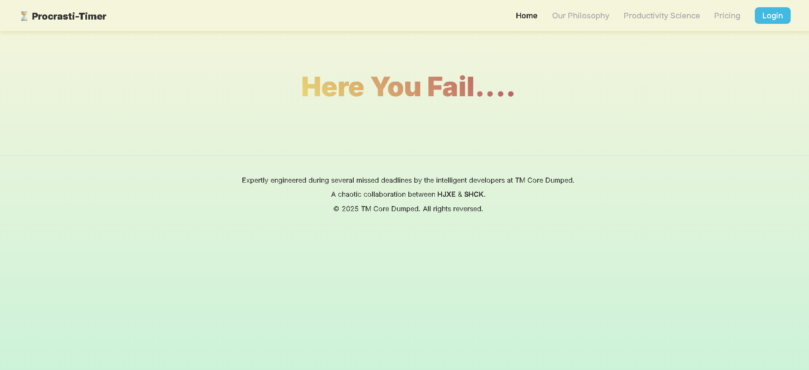
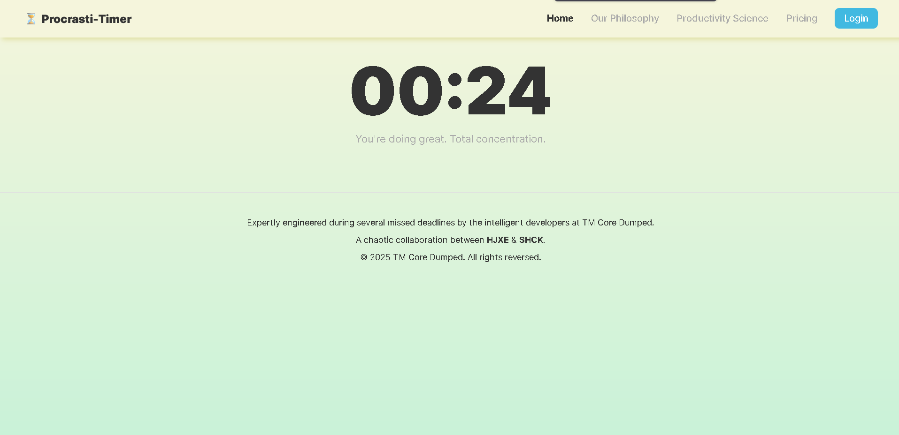
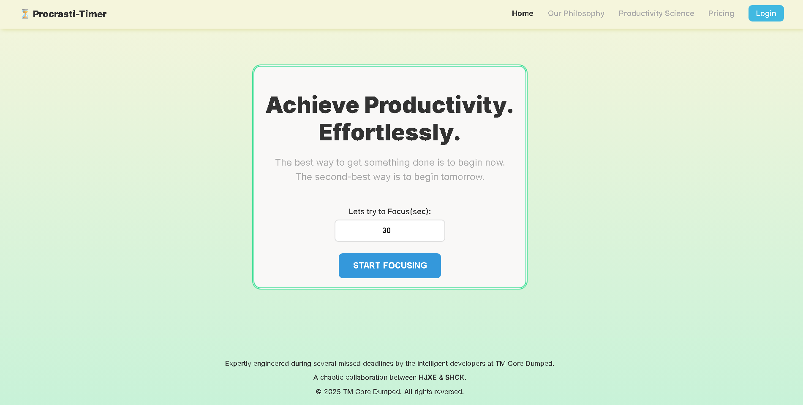

# Procrasti-Timer 🎯

## Basic Details
### Team Name: TM Core Dumped

### Team Members
- Team Lead:Shamil hanan c k - Govt engg college idukki
- Member 2: Hijaz ahmed  - Govt engg college idukki

### Project Description
Procrasti-Timer is a satirical web application that masquerades as a productivity timer but is scientifically designed to sabotage your focus. It helps users achieve maximum distraction by redirecting them to a random time-wasting website when they least expect it, thereby preserving a healthy work-distraction balance.

### The Problem (that doesn't exist)
In today's "hustle culture," workers are dangerously close to achieving their goals. Uninterrupted focus leads to completed tasks, which in turn leads to a terrifying sense of accomplishment. This epidemic of productivity leaves no room for spontaneous Wikipedia deep-dives or discovering new, useless websites.

### The Solution (that nobody asked for)
Procrasti-Timer introduces **Intentional Interruption™** into your workflow. By setting a focus timer, you are actually setting a time bomb of distraction. Our proprietary algorithm ensures you are redirected to a random, useless website at the most inconvenient moment, saving you from the horrors of efficiency.

## Technical Details
### Technologies/Components Used
For Software:
- **Languages:** HTML5, CSS3, JavaScript (ES6)
- **Frameworks:** None
- **Libraries:** None
- **Tools:** Visual Studio Code, Git, GitHub Pages

### Implementation
For Software:
# Installation
No installation is needed! This project runs directly in any modern web browser.

# Run
1. Clone the repository: `git clone https://github.com/shamil-shck/Useless-project_distractor.git`
2. Open the `index.html` file in your browser.

### Project Documentation
For Software:

# Screenshots (Add at least 3)

*The clean, deceptive landing page where users set their "focus" time.*

*The active timer, counting down and displaying a subtly discouraging message.*

*The final "Here You Fail...." message, displayed moments before the user is redirected.*

# Diagrams

*A simple diagram illustrating the user's journey from focus to failure.*

### Project Demo
# Video
[https://shamil-shck.github.io/Useless-project_distractor/](https://shamil-shck.github.io/Useless-project_distractor/)
*This link is a live demo of the deployed project on GitHub Pages.*

## Team Contributions
- **HJXE:** Project Lead, Core JavaScript Logic & Timer Functionality.
- **SHCK:** UI/UX Design, HTML Structure & Satirical Copywriting.

---
Made with ❤️ at TinkerHub Useless Projects 

